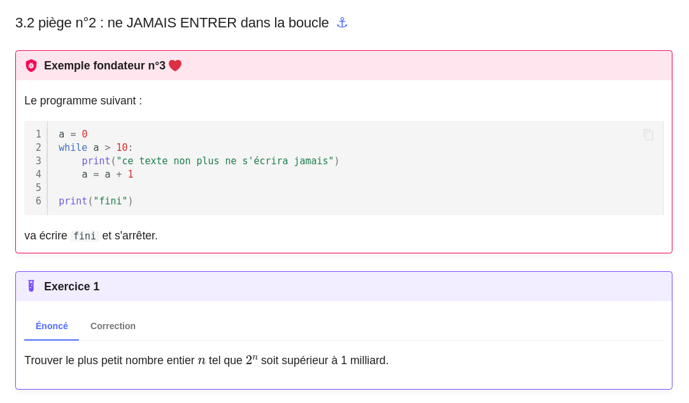

# Présentation

bonjour

## 1. Introduction

- Charles POULMAIRE, enseignant de Mathématiques et de NSI dans l'académie de Versailles. Président de l'AEIF.
- Gilles LASSUS, enseignant de Mathématiques et de NSI dans l'académie de Bordeaux.

Membres de l'[Association des Enseignantes et enseignants d'Informatique de France](/AEIF/AEIF/){. target="_blank"}.

[{: .center}](https://aeif.fr/){. target="_blank"}


## 2. Le partage, le partage, le partage

!!! tip "Déclararation préalable"
    La solution que nous allons présenter implique le dépôt de nos ressources dans une **forge ouverte**. N'importe qui peut donc venir voir les documents, consulter les sources, et ainsi modifier et améliorer le contenu.

    Il n'y a pas de section privée.
    Le contenu est souvent déclaré en licence Creative Commons. (CC BY-SA en ce qui nous concerne)


## 3. Un site, mais à quel prix technique ?

!!! abstract "Partis pris techniques"
    :no_entry: Nous ne souhaitons pas : 

    - écrire intégralement un site en ```html``` / ```JavaScript``` : trop complexe !
    - utiliser de CMS (comme Wordpress) : pas assez de contrôle sur le contenu, et partage des sources difficile.

    :white_check_mark: Nous souhaitons :

    - pouvoir nous concentrer uniquement sur le contenu pédagogique.
    - une courbe d'apprentissage rapide du langage.


:arrow_right: nous écrirons notre contenu en [Markdown](https://fr.wikipedia.org/wiki/Markdown){. target="_blank"}. Le logiciel **MkDocs** se chargera ensuite de construire le site qui affichera notre contenu.


## 4. Exemples de sites utilisant Mkdocs

- [https://squidfunk.github.io/mkdocs-material/getting-started/](https://squidfunk.github.io/mkdocs-material/getting-started/){. target="_blank"}

- [https://e-nsi.forge.aeif.fr/pratique/](https://e-nsi.forge.aeif.fr/pratique/){. target="_blank"}

- [https://ericecmorlaix.github.io/adn-Tutoriel_site_web/MarkDown-Mkdocs_Material/#fichier-md](https://ericecmorlaix.github.io/adn-Tutoriel_site_web/MarkDown-Mkdocs_Material/#fichier-md){. target="_blank"}

- [https://glassus.github.io/terminale_nsi/](https://glassus.github.io/terminale_nsi/){. target="_blank"}


## 5. MkDocs ?

[MkDocs](https://www.mkdocs.org/){. target="_blank"} est un logiciel libre permettant de générer des sites de **documentation** d'autres logiciels. Nous allons utiliser un thème particulier pour MkDocs, nommé [Material for MkDocs](https://squidfunk.github.io/mkdocs-material/){. target="_blank"}, développé et maintenu par [Martin Donath](https://github.com/squidfunk){. target="_blank"}.


Le principe fondamental de cette technologie est de permettre à l'utilisateur de rédiger uniquement ses pages en [Markdown](https://fr.wikipedia.org/wiki/Markdown){. target="_blank"}, sans avoir à écrire de ```html```.

Le Markdown étant un langage de description très facile d'accès et d'utilisation, il est possible de se concentrer uniquement sur le fond, laissant à MkDocs le soin de gérer la forme.


## 6. Ouvrons le capot : quel code pour quel résultat ?

### 6.1 Exemple d'une portion de site 

[{: .center}](https://glassus.github.io/premiere_nsi/T1_Demarrer_en_Python/1.3_Boucle_while/cours/#32-piege-n2-ne-jamais-entrer-dans-la-boucle){. target="_blank"}

### 6.2 Le code en Markdown ayant généré cette portion de site

```
### 3.2 piège n°2 : ne JAMAIS ENTRER dans la boucle

!!! bug "Exemple fondateur n°3 :heart:"
    Le programme suivant :
    ```python
    a = 0
    while a > 10:
        print("ce texte non plus ne s'écrira jamais")
        a = a + 1
        
    print("fini") 
    ```

    va écrire ```fini``` et s'arrêter.


!!! example "Exercice 1"
    === "Énoncé"
        Trouver le plus petit nombre entier $n$ tel que $2^n$ soit supérieur à 1 milliard.
    === "Correction"
        ```python
        n = 1
        while 2**n < 10**9:
            n = n + 1
            print("trop petit")
        print("trouvé : ",n)
        ```

```

## 7. De multiples extensions et possibilités

Le mot d'ordre de la solution MkDocs est la **simplicité**.

Il est toutefois possible de rajouter de multiples fonctionnalités (qui rendront peut-être le code de moins en moins simple).

### 7.1 Prise en charge du Latex.

Aucun problème et aucune lourdeur dans la syntaxe, il suffit d'encadrer son code de $... comme en $\LaTeX$ !

### 7.2 Console Python

Une éditeur Python peut être intégré très facilement :

{{ IDEv() }}

Il nécessite la présence de fichiers particuliers (javascript, css) dans l'arborescence de votre site.

Pour les enseignants d'informatique, il est aussi possible d'intégrer [une console SQL](https://epithumia.github.io/mkdocs-sqlite-console/usage/#afficher-la-consoleide){. target="_blank"} pour réaliser des requêtes en direct.


### 7.3 Intégration d'iframes

À l'intérieur du Markdown, il est possible d'écrire du ```html``` et donc d'intégrer des iframes... mais le code n'est plus très simple et on se retrouve à faire ce qu'on a voulu éviter : du ```html``` !!

!!! note "Exemple d'intégration"
    === "Code utilisé"
        ```
        Regardez cette belle animation GeoGebra :
        <iframe src="https://www.geogebra.org/classic/ahavfqve?embed" width="800" height="600" allowfullscreen style="border: 1px solid #e4e4e4;border-radius: 4px;" frameborder="0"></iframe>
        ```

    === "Rendu"
        Regardez cette belle animation GeoGebra :
        <iframe src="https://www.geogebra.org/classic/ahavfqve?embed" width="800" height="600" allowfullscreen style="border: 1px solid #e4e4e4;border-radius: 4px;" frameborder="0"></iframe>


### 7.4 Générer un pdf à partir d'un fichier Markdown

Il est courant de générer un pdf depuis un fichier Markdown, notamment avec [pandoc](https://pandoc.org/demos.html){. target="_blank"}.

Mais il est possible transformer directement vos pages web générées par MkDocs en un (joli) pdf grâce au plugin [mkdocs-page-pdf](https://github.com/brospars/mkdocs-page-pdf){. target="_blank"} créé par Benoît Ropars. 